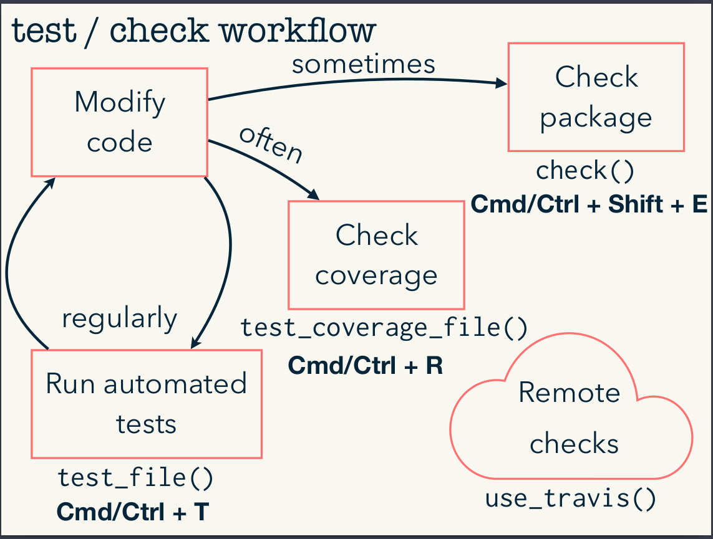

# Road2R

A curated list of amazingly awesome R libraries, resources and package collection.  

## Contributing Information
Please see [author's details](https://github.com/Ronlee12355).  
Collaboration and pull requests are always welcomed!    

## Workflow for Data Science

## Workflow of Text Mining

## Workflow of R Package Development

## Table of Contents
- [Road2R](#road2r)
	- [Contributing Information](#contributing-information)
	- [Workflow for Data Science](#workflow-for-data-science)
	- [Workflow of Text Mining](#workflow-of-text-mining)
	- [Workflow of R Package Development](#workflow-of-r-package-development)
	- [Table of Contents](#table-of-contents)
		- [Data manipulation](#data-manipulation)
		- [Visualization](#visualization)
		- [Import Data](#import-data)
		- [Network graph](#network-graph)
		- [Interactive Graphics](#interactive-graphics)
		- [Word cloud](#word-cloud)
		- [Text mining](#text-mining)
		- [Machine learning](#machine-learning)
		- [Time series](#time-series)
		- [Markdown](#markdown)
		- [Development in R](#development-in-r)
		- [Online blogs](#online-blogs)
		- [Learning materials](#learning-materials)
		- [Cheatsheet](#cheatsheet)
		- [Shiny](#shiny)
		- [Bioinformatics](#bioinformatics)
	
### Data manipulation
*Packages that enable you to manipulate data*

* [dplyr](https://github.com/hadley/dplyr) - a grammar of data manipulation.
* [tibble](https://github.com/hadley/tibble) - efficient display structure for tabular data.
* [dbplyr](https://github.com/tidyverse/dbplyr) - A 'dplyr' Back End for Databases.
* [plyr](https://github.com/hadley/plyr) - the split-apply-combine paradigm for R.
* [tidyr](https://github.com/tidyverse/tidyr) - Easily Tidy Data with 'spread()' and 'gather()' Functions.
* [jsonlite](https://arxiv.org/abs/1403.2805) - A Robust, High Performance JSON Parser and Generator for R.
* [stringr](https://github.com/tidyverse/stringr) - Simple, Consistent Wrappers for Common String Operations.
* [stringi](http://www.gagolewski.com/software/stringi/) - Character String Processing Facilities.
* [data.table](http://r-datatable.com) - Extension of "data.frame".
* [magrittr](https://github.com/smbache/magrittr) - A Forward-Pipe Operator for R.
* [reshape2](https://github.com/hadley/reshape) - Flexibly Reshape Data: A Reboot of the Reshape Package.
* [forcats](https://github.com/tidyverse/forcats) - Tools for Working with Categorical Variables (Factors).
* [broom](http://github.com/tidyverse/broom) - Convert Statistical Analysis Objects into Tidy Data Frames.
* [Matrix](http://Matrix.R-forge.R-project.org/) - Sparse and Dense Matrix Classes and Methods.
* [lubridate](https://github.com/tidyverse/lubridate) - Make Dealing with Dates a Little Easier.
* [xts](http://r-forge.r-project.org/projects/xts) - tools for time series based data.
* [hashmap](https://github.com/nathan-russell/hashmap) - The Faster Hash Map.
* [rlist](https://github.com/rekun-ken/rlist) - A Toolbox for Non-Tabular Data Manipulation.
* [yaml](https://github.com/viking/r-yaml/) - Methods to Convert R Data to YAML and Back.
* [xml2](https://github.com/hadley/xml2/) - Parse XML.
* [lobstr](https://lobstr.r-lib.org) - lobstr provides tools in the same vein as str(), which allow you to dig into the detail of an object.
* [reticulate](https://github.com/rstudio/reticulate) - Interface to 'Python'.
* [moderndive](https://github.com/moderndive/moderndive) - An R package of datasets and wrapper functions for tidyverse-friendly introductory linear regression.  

### Visualization
*Packages that enable you to plot*

* [ggplot2](https://github.com/tidyverse/ggplot2) - Create Elegant Data Visualisations Using the Grammar of Graphics.
* [gganinate](http://github.com/thomasp85/gganimate) - A Grammar of Animated Graphics.
* [ggedit](https://github.com/metrumresearchgroup/ggedit) - Interactive 'ggplot2' Layer and Theme Aesthetic Editor.
* [ggfittext](https://github.com/wilkox/ggfittext) - Fit Text Inside a Box in 'ggplot2'.
* [ggforce](https://cran.r-project.org/package=ggforce) - Accelerating 'ggplot2'.
* [gggenes](https://github.com/wilkox/gggenes) - Draw Arrow Maps in 'ggplot2'. 
* [ggnetwork](https://cran.r-project.org/package=ggnetwork) - Geometrics to Plot Networks with ''ggplot2''. 
* [ggmap](https://github.com/dkahle/ggmap) - Spatial Visualization with ''ggplot2''. 
* [ggpubr](http:/www.sthda.com/english/rpkgs/ggpubr) - ''ggplot2'' Based Publication Ready Plots. 
* [ggrepel](http://github.com/slowkow/ggrepel) - Automatically Position Non-Overlapping Text Labels with 'ggplot2'.
* [ggridge](https://github.com/clauswilke/ggridges) - Ridgeline Plots in 'ggplot2'.
* [ggsci](https://github.com/road2stat/ggsci) - Scientific Journal and Sci-Fi Themed Color palettes for 'ggplot2'.
* [ggsignif](https://github.com/const-ae/ggsignif) - Significance Brackets for 'ggplot2'.
* [ggthemes](http://github.com/jrnold/ggthemes) - Extra Themes, Scales and Geoms for 'ggplot2'.
* [ggvis](http://ggvis.rstudio.com) - Interactive Grammar of Graphics.
* [cowplot](https://github.com/wilkelab/cowplot) - Streamlined Plot Theme and Plot Annotations for 'ggplot2'.
* [treemapify](https://github.com/wilkox/treemapify) - Draw Treemaps in 'ggplot2'.
* [ggalluvial](http://corybrunson.github.io/ggalluvial/) - Alluvial Diagrams in 'ggplot2'.
* [GGally](https://github.com/ggobi/ggally) - Extension to 'ggplot2'.
* [alluvial](https://github.com/mbojan/alluvial) - Alluvial Diagrams.
* [corrplot](https://github.com/taiyun/corrplot) - Visualization of a Correlation Matrix.
* [arulesViz](https://github.com/mhahsler/arulesViz) - Visualizing Association Rules and Frequent Itemsets.
* [gplots](https://cran.r-project.org/package=gplots) - Various R Programming Tools for Plotting Data.
* [rpart.plot](http://www.milbo.org/rpart-plot) - Plot 'rpart' Models: An Enhanced Version of 'plot.rpart'.
* [survival](https://github.com/therneau/survival/) - Survival Analysis. 
* [pheatmap](https://cran.r-project.org/package=pheatmap) - Pretty Heatmap.
* [ROCR](http://rocr.bioinf.mpi-sb.mpg.de) - Visualization the Performance of Scoring Classifiers.
* [pROC](http://expasy.org/tools/pROC/) - Display and Analyze ROC Curves.
* [ggstance](https://github.com/lionel-/ggstance) - Horizontal versions of common plots.
* [ggExtra](https://github.com/daattali/ggExtra) - Marginal histograms for a plot.
* [patchwork](https://github.com/thomasp85/patchwork/) - Simple to combine separate ggplots into the same graphic.

### Import Data
*Packages that enable you to import, load and save data*

* [readr](https://github.com/tidyverse/readr) - Read Rectangular Text Data.
* [openxlsx](https://github.com/awalker89/openxlsx) - Read, Write and Edit XLSX Files
* [readxl](https://github.com/tidyverse/readxl) - Read Excel Files.
* [clipr](https://github.com/mdlincoln/clipr) - Read and Write from the System Clipboard.
* [data.table](http://r-datatable.com) - Extension of "data.frame".
* [feather](https://github.com/wesm/feather) - R Bindings to the Feather 'API'.
* [haven](https://github.com/tidyverse/haven) - Import and Export 'SPSS', 'Stata' and 'SAS' Files.
* [httr](https://github.com/r-lib/httr) - Tools for Working with URLs and HTTP.
* [rvest](https://github.com/hadley/rvest) - Easily Harvest (Scrape) Web Pages.
* [DBI](http://r-dbi.github.io/DBI) - R Database Interface
* [RMySQL](https://github.com/rstats-db/RMySQL) - MySQL driver for DBI
* [RPostgres](https://github.com/rstats-db/RPostgres) - Postgres driver for DBI
* [RSQLite](https://github.com/rstats-db/RSQLite) - SQlite driver for DBI
* [git2r](https://github.com/ropensci/git2r) - Provides Access to Git Repositories.
* [RCurl](http://www.omegahat.net/RCurl) - General Network (HTTP/FTP/...) Client Interface for R.

### Network graph
*packages that enable you to visualize network*

* [igraph](http://igraph.org) - Network Analysis and Visualization.
* [ggnetwork](https://cran.r-project.org/package=ggnetwork) - Geometrics to Plot Networks with ''ggplot2''.  
* [network3D](https://CRAN.R-project.org/package=networkD3) - D3 JavaScript Network Graphs from R.
* [network](http://statnet.org/) - Classes for Relational Data.
* [sna](http://www.statnet.org) - Tools for Social Network Analysis.
* [snow](https://CRAN.R-project.org/package=snow) - Simple Network of Workstations.
* [visNetwork](http://datastorm-open.github.io/visNetwork/) - Network Visualization using 'vis.js' Library.

### Interactive Graphics
*packages that enable you to make interactive graphics*

* [htmlwidgets](http://www.htmlwidgets.org/) - framework for creating JavaScript widgets with R.
* [networkD3](http://christophergandrud.github.io/networkD3/) - Interative d3 network graphs.
* [d3heatmap](https://github.com/rstudio/d3heatmap) - Interactive d3 heatmaps.
* [DT](http://rstudio.github.io/DT/) - Interactive tables.
* REmap - Create html maps by Echarts.
* [echarts4r](https://github.com/JohnCoene/echarts) - EChart htmlwidget.
* [leaflet](http://rstudio.github.io/leaflet/) - Interactive maps.
* [plotly](https://plot.ly/r/) - Interactive plots.
* [Highcharter](http://jkunst.com/highcharter/) - Interactive Highcharts plots.
* [visNetwork](http://dataknowledge.github.io/visNetwork) - Interactive network graphs.

### Word cloud
*packages that enable you to draw word cloud*

* [wordcloud](http://research.cens.ucla.edu/) - Word Clouds.
* [wordcloud2](https://github.com/lchiffon/wordcloud2) - Create Word Cloud by 'htmlwidget'.

### Text mining
*packages that enable you to do text mining*

* [tidytext](http://github.com/juliasilge/tidytext) - Text Mining using 'dplyr', 'ggplot2', and Other Tidy Tools.
* [widyr](http://github.com/dgrtwo/widyr) - Widen, Process, then Re-Tidy Data.
* [tm](http://tm.r-forge.r-project.org/) - Text Mining Package.
* [NLP](https://cran.r-project.org/package=NLP) - Natural Language Processing Infrastructure.
* [janeaustenr](https://cran.r-project.org/package=janeaustenr) - Jane Austen's Complete Novels.
 

### Machine learning
*packages that enable you to deploy machine learning algorithms*

* [caret](https://github.com/topepo/caret/) - Classification and Regression Training.
* [xgboost](https://github.com/dmlc/xgboost) - Extreme Gradient Boosting.
* [glmnet](http://www.jstatsoft.org/v33/i01/.) - Lasso and Elastic-Net Regularized Generalized Linear Models.
* [e1071](https://cran.r-project.org/package=e1071) - Misc Functions of the Department of Statistics, ProbabilityTheory Group (Formerly: E1071), TU Wien.
* [arules](https://github.com/mhahsler/arules) - Mining Association Rules and Frequent Itemsets.
* [car](https://CRAN.R-project.org/package=car) - Companion to Applied Regression.
* [igraph](http://igraph.org) - PageRank algotirhm.
* [kernlab](https://cran.r-project.org/package=kernlab) - Kernel-Based Machine Learning Lab.
* [modelr](https://github.com/hadley/modelr) - Modelling Functions that Work with the Pipe.
* [gbm](https://github.com/gbm-developers/gbm) - gradient boosted regression models.
* [nlme](https://cran.r-project.org/package=nlme) - Linear and Nonlinear Mixed Effects Models.
* [randomForest](https://www.stat.berkeley.edu/~breiman/RandomForests/) - Breiman and Cutler's Random Forests for Classification and Regression.
* [rpart](https://cran.r-project.org/package=rpart) - Recursive Partitioning and Regression Trees.
* [boot](https://cran.r-project.org/package=boot) - Bootstrap Functions (Originally by Angelo Canty for S).
* [gbm](https://github.com/gbm-developers/gbm) - gradient boosted regression models.
* [nnet](http://www.stats.ox.ac.uk/pub/MASS4/) - Feed-Forward Neural Networks and Multinomial Log-Linear Models.
* [neuralnet](https://github.com/bips-hb/neuralnet) - Training of Neural Networks.
* [h2o](http://www.h2o.ai/) - parallel distributed machine learning algorithms.
* [mlr](https://github.com/mlr-org/mlr) - Machine Learning in R.
* [ggpomological](https://github.com/gadenbuie/ggpomological) - Pomological Colors.
* [visdat](https://github.com/ropensci/visdat) - Preliminary Exploratory Visualisation of Data.
* [lares](https://github.com/laresbernardo/lares) - R Package for Analytics and Machine Learning.  
* [mlr3](https://github.com/mlr-org/mlr3) - A clean, object-oriented rewrite of mlr.  
* [mlrCPO](https://github.com/mlr-org/mlrCPO) - Composable Preprocessing Operators for MLR. 

### Time series
*packages that enable you to play with time*

* [xts](https://github.com/joshuaulrich/xts) - eXtensible Time Series.
* [forecast](https://github.com/robjhyndman/forecast) - Forecasting Functions for Time Series and Linear Models.
* [zoo](http://zoo.R-Forge.R-project.org/) - S3 Infrastructure for Regular and Irregular Time Series (Z's Ordered Observations).
* [tsfeatures](https://github.com/robjhyndman/tsfeatures) - The R package tsfeatures provides methods for extracting various features from time series data.

### Markdown
*packages that enable you to write markdwon in R*

* [rmarkdown](https://github.com/rstudio/rmarkdown) - Dynamic Documents for R.
* [rsconnect](https://cran.r-project.org/package=rsconnect) - Deployment Interface for R Markdown Documents and Shiny Applications.
* [knit](https://yihui.name/knitr/) - A General-Purpose Package for Dynamic Report Generation in R.   
* [tinytex](https://github.com/rstudio/tinytex) - tinytex: Helper Functions to Install and Maintain TeX Live, and Compile LaTeX Documents.   

### Development in R
*packages that enable you to develop your own project*

* [devtools](https://github.com/r-lib/devtools) - Tools to Make Developing R Packages Easier.
* [Rcpp](https://github.com/RcppCore/Rcpp) - Seamless R and C++ Integration.
* [testthat](https://github.com/r-lib/testthat) - Unit Testing for R.
* [roxygen2](https://github.com/klutometis/roxygen) - In-Line Documentation for R.
* [bindrcpp](https://github.com/krlmlr/bindrcpp) - An 'Rcpp' Interface to Active Bindings.
* [RStudio Desktop IDE](https://www.rstudio.com/products/rstudio/#Desktop) - IDE.
* [RStudio Server Open Source](https://www.rstudio.com/products/rstudio/#Server) - server IDE.
* [Anaconda](https://www.anaconda.com) - The World's Most Popular Python/R Data Science Platform.
* [Visual Studio Code](https://code.visualstudio.com) - Open source code editor.
* [goodpractice](https://github.com/MangoTheCat/goodpractice) - Advice on R Package Building.  
* [usethis](https://github.com/r-lib/usethis) - Automate Package and Project Setup.

### Online blogs
*Online blogs.*

* [RPubs](http://www.rpubs.com) - Easy web publishing from R.
* [Shinyapps](https://www.shinyapps.io/) - Share your Shiny Applications Online.
* [R-bloggers](https://www.r-bloggers.com) - R news and tutorials contributed by (750) R bloggers.
* [RWeekly](https://rweekly.org) - Weekly Updates from the Entire R Community.
* [RDocumentation](https://www.rdocumentation.org) - Search all 16,944 CRAN, Bioconductor and GitHub packages.
* [Rstudio Community](https://community.rstudio.com) - The Rstudio Community.
* [生信爱好者周刊](https://github.com/ShixiangWang/weekly) - 生信爱好者周刊，Weekly of bioinformatics lovers.

### Learning materials
*Online learning materials*  

* [Writing R extension](https://cran.r-project.org/doc/manuals/r-release/R-exts.pdf) - The online pdf of telling you how to write your own packages.
* [R packages](http://r-pkgs.had.co.nz) - This is the book site for “R packages”. It was published with O’Reilly in April 2015.
* [R for Data Science](https://r4ds.had.co.nz) - This is the website for “R for Data Science”.
* [Text Mining with R - A Tidy Approach](https://www.tidytextmining.com) - This is the website for Text Mining with R.
* [R Start Here](https://github.com/rstudio/RStartHere) - A guide to some of the most useful R Packages that we know about.
* [ggplot2 Doc](https://ggplot2.tidyverse.org/reference/) - Reference of ggplot2.
* [Plotly for R](https://plotly-r.com/index.html) - plotly for R.
* [Efficient R programming](https://csgillespie.github.io/efficientR/) - Efficient R programming by Colin Gillespie and Robin Lovelace.
* [Advanced R](https://adv-r.hadley.nz/) - Advanced R.
* [Advanced R Solutions](https://advanced-r-solutions.rbind.io/) - Advanced R Solutions.   
* [bookdown: Authoring Books and Technical ](https://bookdown.org/yihui/bookdown/) - Documents with R Markdown.
* [Geocomputation with R](https://geocompr.robinlovelace.net/) - Geocomputation with R.
* [knitr](https://yihui.name/knitr/) - knitr: elegant, flexible, and fast dynamic report generation with R.
* [Machine Learning with TensorFlow(R version)](https://github.com/haven-jeon/TensorFlow-Book-R) - This repository is for practicing R tensorflow modeling exercises.
* [R的极客理想-高级开发篇](https://github.com/bsspirit/book-r2) - R的极客理想-高级开发篇.
* [swirl](https://github.com/swirldev/swirl) - swirl is a platform for learning (and teaching) statistics and R simultaneously and interactively.
* [stats337](https://github.com/hadley/stats337) - Stats 337: Readings in Applied Data Science.
* [Data Science in Education Book](https://github.com/data-edu/data-science-in-education) - Book on data science (or data analysis) in education using R.
* [datascience-box](https://github.com/rstudio-education/datascience-box) - Data Science Course in a Box.
* [R語言翻轉教室](http://www.datascienceandr.org) - 全中文R語言互動式教材.
* [Statistical Rethinking with brms ggplot2 and the tidyverse](https://bookdown.org/connect/#/apps/1850/access) - Statistical Rethinking with brms, ggplot2, and the tidyverse.  
* [DataScienceR](https://github.com/ujjwalkarn/DataScienceR) - a curated list of R tutorials for Data Science, NLP and Machine Learning. 
* [MLwR](https://github.com/dataspelunking/MLwR) - Machine Learning with R. 
* [ml-course-r](https://github.com/faridcher/ml-course-r) - R code for the assignments of Ng's Coursera machine learning course.  
* [Book on data science (or data analysis) in education using R](https://github.com/data-edu/data-science-in-education) - Book on data science (or data analysis) in education using R.  
* [R Workshops for Beginners](https://github.com/Jiaying-Wu/R-Workshops-for-Beginners) - No programming experience required!
* [Shiny Tutorial in Chinese](http://yanping.me/shiny-tutorial/) - Shiny中文教程.  
* [R语言教程](http://www.math.pku.edu.cn/teachers/lidf/docs/Rbook/html/_Rbook/index.html) - R Tutorial From Peking University (Mandarin Chinese).  
* [Tidy evaluation](https://tidyeval.tidyverse.org/) - This guide is now superseded by more recent efforts at documenting tidy evaluation in a user-friendly way.   
* [DIYtranscriptomics](https://vimeo.com/showcase/6565319) - A full course on the analysis of RNA-seq data using R programming environment and the Bioconductor suite of software packages – a versatile and robust collection of tools for bioinformatics, statistics, and plotting.   

### Cheatsheet
*Cheatsheets of Rstudio packages*

* [RStudio IDE Cheat Sheet](https://github.com/rstudio/cheatsheets/raw/master/rstudio-ide.pdf) - RStudio IDE Cheat Sheet.  
* [R Markdown Cheat Sheet](https://github.com/rstudio/cheatsheets/raw/master/rmarkdown-2.0.pdf) - R Markdown Cheat Sheet.
* [Shiny](https://github.com/rstudio/cheatsheets/raw/master/shiny.pdf) - Shiny Cheat Sheet. 
* [Package Development Cheat Sheet](https://github.com/rstudio/cheatsheets/raw/master/package-development.pdf) - Package Development Cheat Sheet.  
* [Data Import Cheat Sheet](https://github.com/rstudio/cheatsheets/raw/master/data-import.pdf) - Data Import Cheat Sheet. 
* [Data Transformation Cheat Sheet](https://github.com/rstudio/cheatsheets/raw/master/data-transformation.pdf) - Data Transformation Cheat Sheet(dplyr). 
* [Data Visualization Cheat Sheet](https://github.com/rstudio/cheatsheets/raw/master/data-visualization-2.1.pdf) - Data Visualization Cheat Sheet with ggplot2.  
* [Apply Functions Cheat Sheet with purrr](https://github.com/rstudio/cheatsheets/raw/master/purrr.pdf) - Apply Functions Cheat Sheet.
* [Deep Learning with Keras Cheat Sheet](https://github.com/rstudio/cheatsheets/raw/master/keras.pdf) - Deep Learning with Keras Cheat Sheet. 
* [Sparklyr Cheat Sheet](https://github.com/rstudio/cheatsheets/raw/master/sparklyr.pdf) - Sparklyr Cheat Sheet.
* [Work with Strings](https://github.com/rstudio/cheatsheets/raw/master/strings.pdf) - Work with Strings Cheat Sheet.
* [Dates and times with lubridate](https://github.com/rstudio/cheatsheets/raw/master/lubridate.pdf) - Dates and Times Cheat Sheet.
* [Advanced R](https://www.rstudio.com/wp-content/uploads/2016/02/advancedR.pdf) - Environments, data Structures, Functions, Subsetting and more by Arianne Colton and Sean Chen.
* [Caret](https://github.com/rstudio/cheatsheets/raw/master/caret.pdf) - Modeling and Machine Learning in R with the caret package by Max Kuhn. 
* [data.table](https://github.com/rstudio/cheatsheets/raw/master/datatable.pdf) - Data manipulation with data.table, cheatsheet by  Erik Petrovski.
* [Base R](http://github.com/rstudio/cheatsheets/raw/master/base-r.pdf) - Base R.
* [cartography](https://github.com/rstudio/cheatsheets/raw/master/cartography.pdf) - Thematic maps with spatial objects by Timothée Giraud. 
* [estimatr](https://github.com/rstudio/cheatsheets/raw/master/estimatr.pdf) - Fast, robust estimators for common models. 
* [eurostat](https://github.com/rstudio/cheatsheets/raw/master/eurostat.pdf) - R tools to access the eurostat database, by rOpenGov. 
* [h2o](https://github.com/rstudio/cheatsheets/raw/master/h2o.pdf) - The R interface to h20’s algorithms for big data and parallel computing.
* [How big is your graph?](https://github.com/rstudio/cheatsheets/raw/master/how-big-is-your-graph.pdf) - Graph sizing with base R.
* [LaTeX](https://wch.github.io/latexsheet/) - A reference to the LaTeX typesetting language, useful in combination with knitr and R Markdown.
* [leaflet](https://github.com/rstudio/cheatsheets/raw/master/leaflet.pdf) - Interactive maps in R with leaflet, by Kejia Shi. 
* [Machine Learning Modelling](https://github.com/rstudio/cheatsheets/raw/master/Machine%20Learning%20Modelling%20in%20R.pdf) - A tabular guide to machine learning algorithms in R, by Arnaud Amsellem.
* [mlr](https://github.com/rstudio/cheatsheets/raw/master/mlr.pdf) - The mlr package offers a unified interface to R’s machine learning capabilities.
* [Mosaic](https://github.com/mlaviolet/Mosaic-cheatsheets/raw/master/mosaic-cheatsheet-gf.pdf) - The mosaic package is for teaching mathematics, statistics, computation and modeling. 
* [nardl](https://github.com/rstudio/cheatsheets/raw/master/nardl.pdf) - The nardl package estimates the nonlinear cointegrating autoregressive distributed lag model.
* [xplain](https://github.com/rstudio/cheatsheets/raw/master/xplain.pdf) - Explain statistical functions with XML files and xplain. 
* [Parallel Computation](https://github.com/rstudio/cheatsheets/raw/master/parallel_computation.pdf) - Parallel computing in R with the parallel, foreach, and future packages. By Ardalan Mirshani. 
* [quanteda](https://github.com/rstudio/cheatsheets/raw/master/quanteda.pdf) - Quantitative Analysis of Textual Data in R with the quanteda package by Stefan Müller and Kenneth Benoit. 
* [randomizr](https://github.com/rstudio/cheatsheets/raw/master/randomizr.pdf) - Automate random assignment and sampling with randomizr. By Alex Coppock. 
* [Regular Expressions](https://github.com/rstudio/cheatsheets/raw/master/regex.pdf) - Basics of regular expressions and pattern matching in R by Ian Kopacka.
* [Simple Features (sf)](https://github.com/rstudio/cheatsheets/raw/master/sf.pdf) - Tools for working with spatial vector data: points, lines, polygons, etc. Cheatsheet by Ryan Garnett. 
* [sjmisc](http://github.com/rstudio/cheatsheets/raw/master/sjmisc.pdf) - dplyr friendly Data and Variable Transformation, by Daniel Lüdecke.
* [survminer](https://github.com/rstudio/cheatsheets/raw/master/survminer.pdf) - Elegant survival plots, by Przemyslaw Biecek. 
* [Syntax Comparison](https://github.com/rstudio/cheatsheets/raw/master/syntax.pdf) - Three code styles compared: $, formula, and tidyverse. By Amelia McNamara.
* [Teach R](https://github.com/rstudio/cheatsheets/raw/master/teachR.pdf) - Concise advice on how to teach R or anything else. By Adi Sarid.  

### Shiny    
*Shiny Applications Development Materials*   

* [Shiny](https://github.com/rstudio/shiny) - Web Application Framework for R.
* [Shiny Tutorials](http://shiny.rstudio.com/tutorial/) - Shiny Tutorials.  
* [shinyAce](https://github.com/trestletech/shinyAce) - Ace editor bindings to enable a rich text editing environment within Shiny.  
* [shinyBS](https://github.com/ebailey78/shinyBS) - Twitter Bootstrap Components for Shiny.  
* [shinydashboard](http://rstudio.github.io/shinydashboard/) - Create Dashboards with 'Shiny'.  
* [shinyjs](https://deanattali.com/shinyjs) - Easily Improve the User Experience of Your Shiny Apps in Seconds.  
* [Shiny Developer Conference](https://resources.rstudio.com/shiny-developer-conference) - Shiny Developer Conference.  
* [ShinyTrials](https://github.com/Ronlee12355/ShinyTrials) - Shiny applications with shiny & shinydashboard.  
* [shiny.io](https://www.shinyapps.io/) - Share your Shiny Applications Online.  
* [Shiny Applications Examples](http://shiny.rstudio.com/gallery) - Examples of interactive web apps using shiny.  
* [shiny server](https://github.com/rstudio/shiny-server) - Host Shiny applications over the web.   
* [Mastering Shiny](https://mastering-shiny.org/) - Mastering Shiny: a book.
* [Awesome Shiny Extensions](https://github.com/nanxstats/awesome-shiny-extensions) - Awesome Shiny Extensions.

### Bioinformatics
*Bioinformatics Tools Implemented in R*

* [CMSclassifier](https://github.com/Sage-Bionetworks/CMSclassifier) - An R package and an example data set are provided to run the CMSclassifier.
* [CMScaller](https://github.com/peterawe/CMScaller) - an R package for consensus molecular subtyping of colorectal cancer pre-clinical models.  
* [genefu](https://github.com/bhklab/genefu) - R package providing various functions relevant for gene expression analysis with emphasis on breast and ovarian cancers.  
* [CancerSubtypes](http://bioconductor.org/packages/release/bioc/html/CancerSubtypes.html) - Cancer subtypes identification, validation and visualization based on multiple genomic data sets. 
* [consensusOV](https://bioconductor.org/packages/release/bioc/html/consensusOV.html) - Gene expression-based subtype classification for high-grade serous ovarian cancer.  
* [ConsensusClusterPlus](https://bioconductor.org/packages/release/bioc/html/ConsensusClusterPlus.html) - ConsensusClusterPlus: a class discovery tool with confidence assessments and item tracking.    
* [WGCNA](http://www.genetics.ucla.edu/labs/horvath/CoexpressionNetwork/Rpackages/WGCNA) - WGCNA: an R package for weighted correlation network analysis.     
* [ImmuLncRNA](http://bio-bigdata.hrbmu.edu.cn/ImmLnc/jt-download.jsp) - The R package 'ImmulancRNA' contains 3 method which can caculate the tumor purity, partial correlation coefficient and identify the lncRNA-pathway pairs.    
* [randomForestSRC](https://www.randomforestsrc.org/articles/getstarted.html) - R-package for random forest analysis of regression, classification, survival and more.     
* [plsRcox](https://github.com/fbertran/plsRcox/) - Partial Least Squares Regression for Cox Models and Related Techniques.   
* [superpc](https://cran.r-project.org/web/packages/superpc/index.html) - Supervised Principal Components.   
* [CoxBoost](http://cran.nexr.com/web/packages/CoxBoost/index.html) - Cox models by likelihood based boosting for a single survival endpoint or competing risks.     
* [survivalsvm](https://cran.rstudio.com/web/packages/survivalsvm/index.html) - Survival Support Vector Analysis.   
* [GSVA](https://bioconductor.org/packages/release/bioc/html/GSVA.html) - Gene Set Variation Analysis for microarray and RNA-seq data.   
* [isomiRseeker](https://github.com/amanzju/MDEHT/tree/master/isomiRseeker) - Detect miRNA isoforms from small RNA-seq data.   
* [TCGAbiolinks](https://github.com/BioinformaticsFMRP/TCGAbiolinks) - TCGAbiolinks - An R/Bioconductor package for integrative analysis with TCGA data.   
* [clusterProfiler](https://github.com/YuLab-SMU/clusterProfiler) - clusterProfiler: an R package for comparing biological themes among gene clusters.    
* [glmnet](https://cran.r-project.org/web/packages/glmnet/index.html) - glmnet: Lasso and Elastic-Net Regularized Generalized Linear Models.     
* [OmicCircos](https://bioconductor.org/packages/release/bioc/html/OmicCircos.html) - an R application and package for generating high-quality circular plots for omics data.   
* [maftools](https://github.com/PoisonAlien/maftools) - maftools - An R package to summarize, analyze and visualize MAF files.   